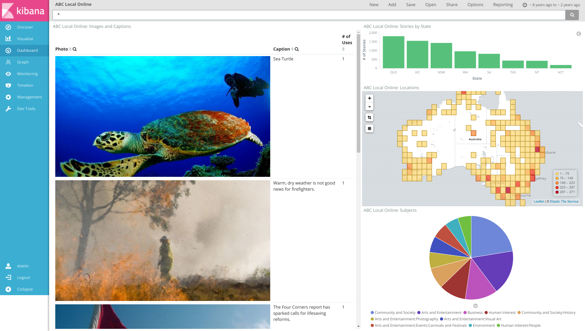
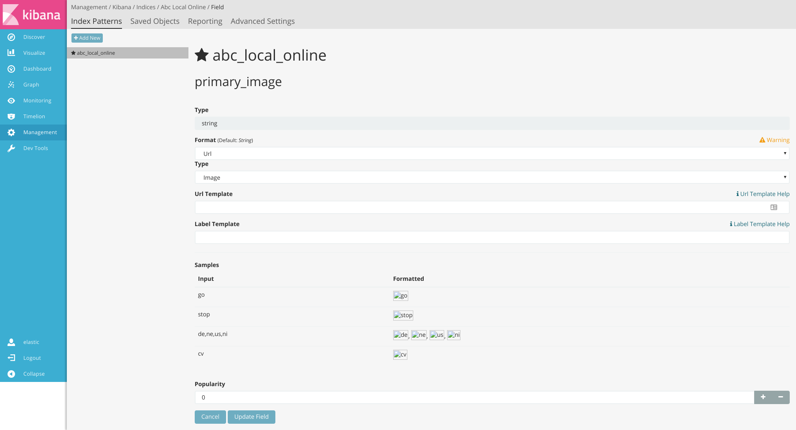

# ABC Local Online Photo Stories 2009-2014

[Source](https://data.gov.au/dataset/abc-local-online-photo-stories-2009-2014)

## Description

This data set contains metadata and links for around 8,500 stories
created around Australia by ABC Local Online reporters. All the
stories are currently published live on the abc.net.au site.

## Example



## Structure

The data consists of:
* Photo Caption
* Photo URL
* Story URL
* Reporting station
* State
* Geo coordinates of story location

## Requirements

* Elasticsearch 5.0.0
* Logstash 5.0.0
* Kibana 5.0.0

This config assumes you are running a default out-of-the-box
Elasticsearch/Logstash/Kibana installation on the same host.

## Usage

### Indexing the data

You'll need to add the Elasticsearch index mappings, which defines how
the data is formatted when stored in Elasticearch. Run the following
curl command to create the index with the defined mappings:

```
curl -XPUT -u elastic:changeme http://localhost:9200/abc_local_online -d @elasticsearch-mapping.json
```

Next, you need to index the data into Elasticsearch.  Run the
following command:

```
cat ./localphotostories20092014csv.csv | path/to/logstash -f ./logstash.conf
```

### Visualising the data

Configure a
new
[index pattern](https://www.elastic.co/guide/en/kibana/current/tutorial-define-index.html) in
Kibana for the `abc_local_online` index.

Next you should add
a
[field formatter](https://www.elastic.co/guide/en/kibana/current/field-formatters-string.html) fior
the `primary_image` field to set it as a *URL* format:



Finally, select **Management->Saved Objects->Import** and locate the
`kibana-export.json` file.  After importing, you should have a
dashboard called **ABC Local Online** which you can now use to explore
the dataset.
