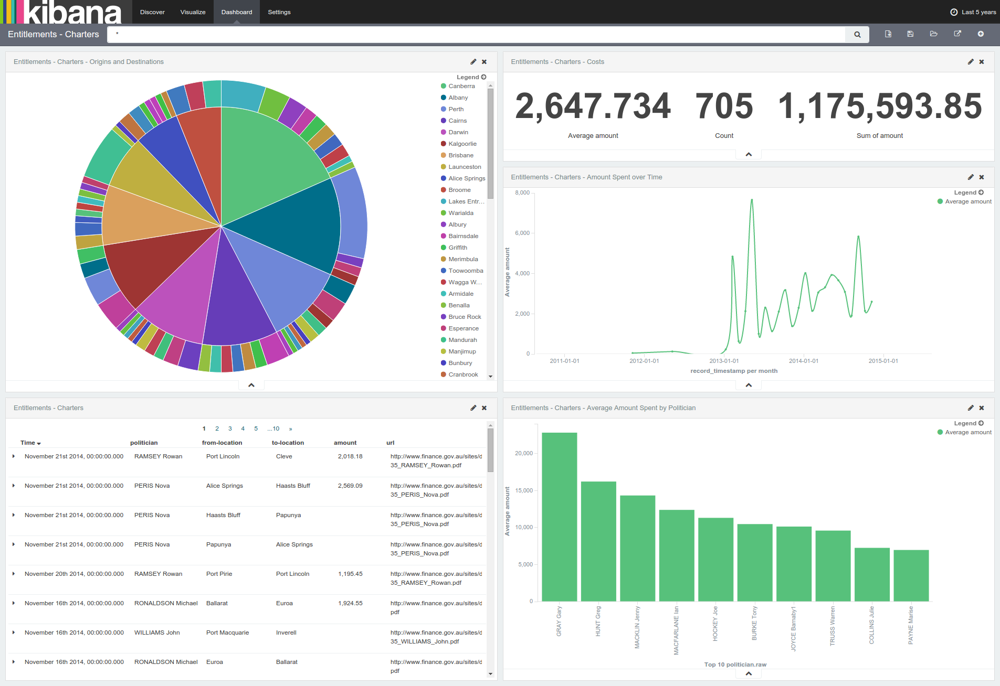
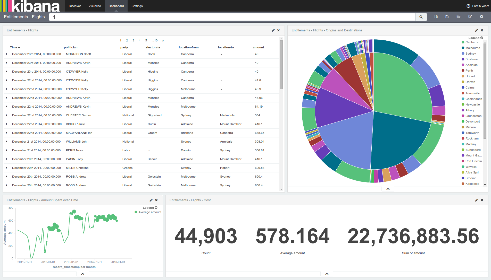
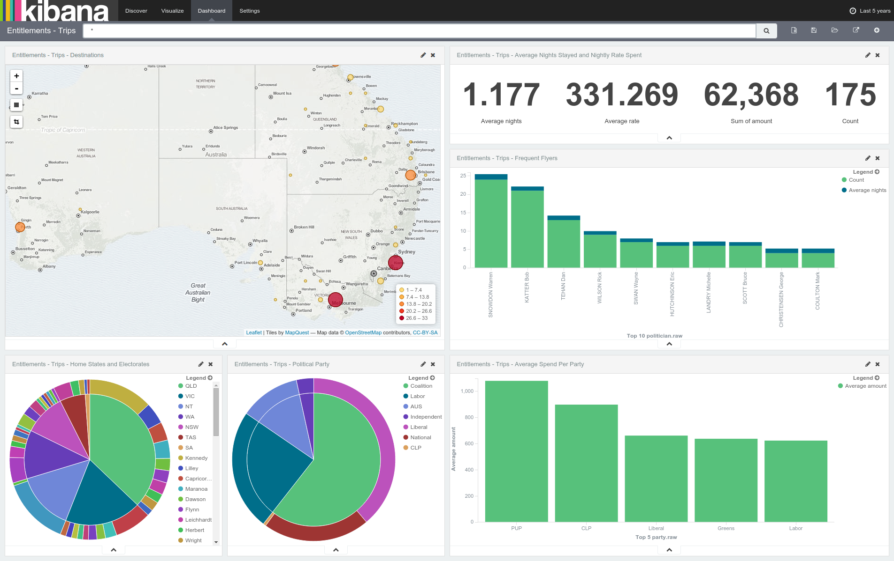

# About

This directory contains the components needed to create an ELK
instance that can analyze the data provided by
[The Guardian](http://www.theguardian.com/au) for [Australian
Politician's Entitlements and Expenses](http://www.theguardian.com/australia-news/datablog/2015/aug/07/politicians-entitlements-and-expenses-help-investigate-four-years-of-data)
using the fantastic Kibana tool backed by Elasticsearch.

# Directories

* `Data`: cleaned data files used to import the data with Logstash.
* `Elasticsearch`: Elasticsearch snapshot of the index containing the
imported data, used by Kibana.
* `Logstash`: Logstash configuration files used to import the data.
* `Kibana`: Kibana dashboards, visualizations and searches pre-configured for the data.

# Usage

## Import into own ELK stack

If you've got your own ELK stack, you use the following steps to
import the Elasticsearch snapshot and Kibana dashboards and play with
the data.

* In Elasticsearch, add the `Elasticsearch` directory in this git repo as an
Elasticsearch snapshot repository and then import the snapshot
*entitlements*.
* In Kibana, import the dashboard/visualizations export in the `Kibana`
directory.
* Check out the new **Entitlements - ...** dashboards in your Kibana
instance.

# Examples







# Advanced

## (Re)Indexing the data

In the `Logstash` directory, you will find the Logstash configs that
were used to import the various files in the `Data` directory to
Elasticsearch.  The mapping of config files to data files is as
follows:

Config File | Data File
------------|----------
`charters.conf` | `Charters 2014 - output.csv.csv`
`electorate-business.conf` | `Electorate business outside of electorate 2014 - Sheet1.csv`
`flights-2012-2013.conf` | `Flights 2012 - 2013 - output.csv.csv`
`flights-2014.conf` | `Flights 2014.csv`

To (re)index the data, use a command like the following (after adjusting the config files to suit):

```
cat /path/to/data/file | path/to/logstash -f /path/to/config/file
```
